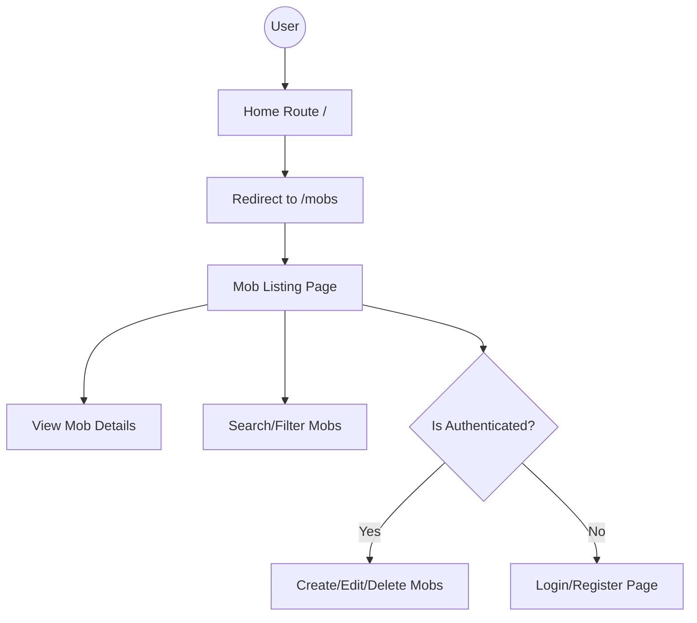

# Application Flow

The Minecraft Mob Wiki follows the standard MVC (Model-View-Controller) pattern provided by Laravel.

## User Journey

## Request Lifecycle

1. **Routing**: The request enters through `routes/web.php`. Public routes (`index`, `show`) are accessible to everyone. Secret routes are protected by the `auth` middleware.
2. **Controller**: `MobController` handles the business logic:
   - Fetches data from the `Mob` model.
   - Handles image uploads using `Storage` facade.
   - Validates incoming data from forms.
3. **Model**: The `Mob` and `Category` models interact with the MySQL database via Eloquent ORM.
4. **View**: Blade templates in `resources/views/mobs/` render the final HTML using Tailwind CSS for styling.
5. **Storage**: Images are stored in `storage/app/public/mobs` and accessed via the `public/storage` symlink.
