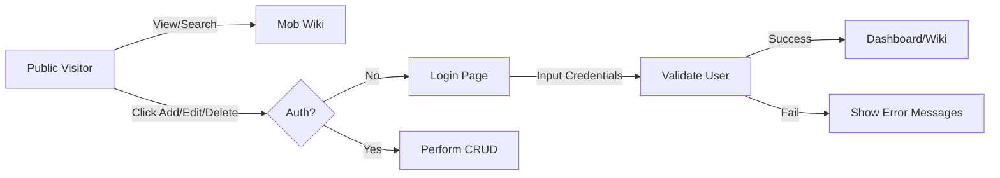

# Authentication Flow

The project utilizes **Laravel Breeze** for a clean and simple authentication system.

## Setup
- **Breeze Starter Kit**: Installed with Blade templates and Tailwind CSS.
- **Middleware**: Routes are protected using the `auth` middleware.

## Flow Diagram

## Implementation Details
1. **Public Access**: 
   - `Route::get('/mobs', ...)`
   - `Route::get('/mobs/{mob}', ...)`
2. **Protected Access**:
   - `Route::middleware(['auth'])->group(...)`
   - Covers: `create`, `store`, `edit`, `update`, `destroy`.
3. **Session Management**: Handled by Laravel's default session driver (configured to `database` in `.env`).
4. **User Model**: Standard `App\Models\User` with typical Breeze authentication features.
