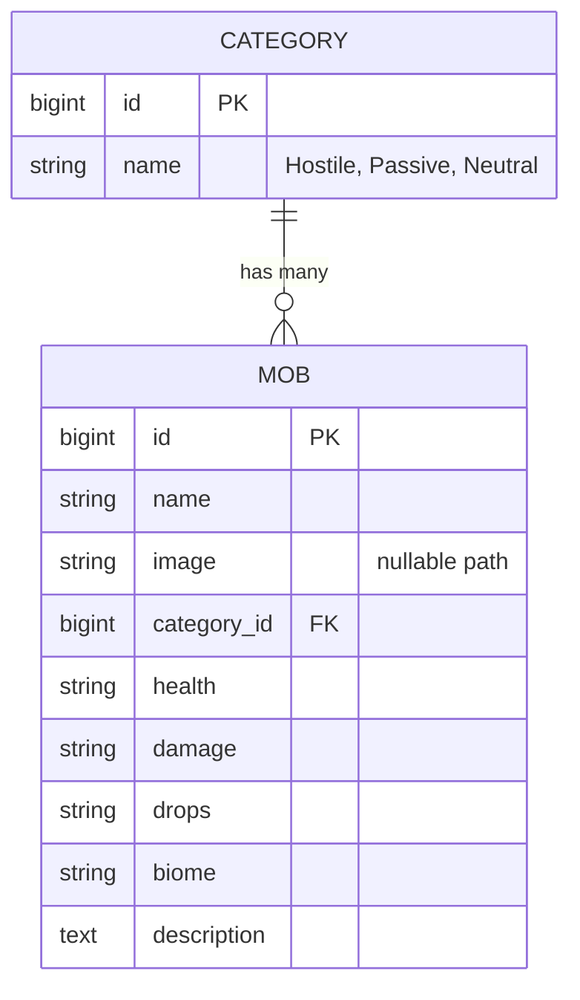

# Database Design

The Minecraft Mob Wiki uses a relational database structure (MySQL) to manage mobs and their categories.

## Entity Relationship Diagram (ERD) concept

## Tables Explanation

### 1. `categories`
Stores the classification of mobs.
- `id`: Primary key.
- `name`: Unique name of the category (e.g., Hostile).

### 2. `mobs`
Stores the detailed information about each mob.
- `id`: Primary key.
- `name`: Common name of the mob (e.g., Creeper).
- `image`: Relative path to the stored image file.
- `category_id`: Foreign key linked to `categories.id`.
- `health`: HP information.
- `damage`: Attack strength info.
- `drops`: Items dropped upon death.
- `biome`: Natural habitat.
- `description`: Detailed behavior and lore.

## Relationships
- **One-to-Many**: One category (e.g., Hostile) can contain many mobs (Creeper, Zombie, Skeleton). Each mob belongs to exactly one category.
